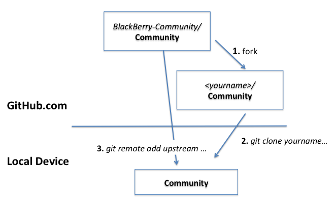
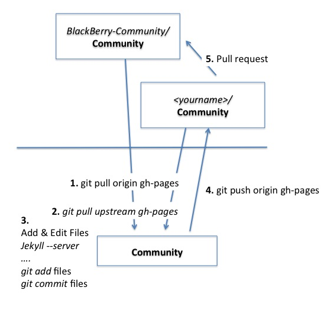
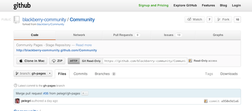
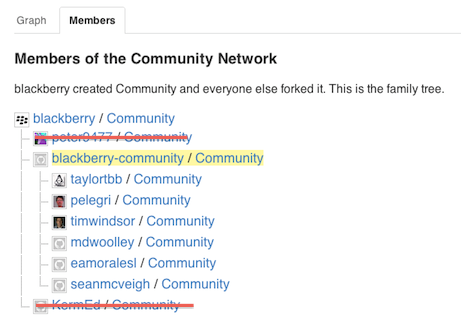
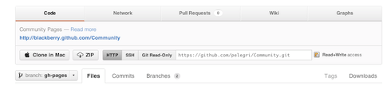
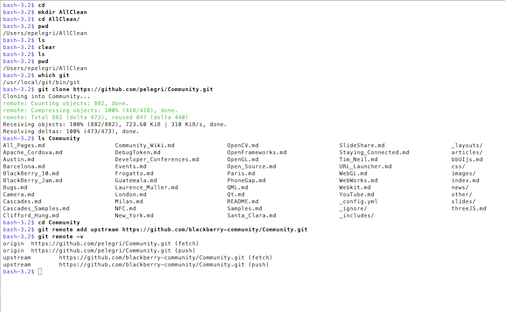



This page describes in detail *How to Create a New Page* in the wiki.  

Also see:
* How to [Propose a New Page][propose new page]
* How to do a [Quick Edit][quick edit] to an existing page
* A brief [Technology Overview]
* An overview of [Contribution Opportunities](Contribute.html).

### Background

The Wiki is a [Git repo][4] hosted at [GitHub](http://en.wikipedia.org/wiki/GitHub)
using [Pages](http://help.github.com/pages/),
[Markdown](http://daringfireball.net/projects/markdown/ "source files end in .md")
and
[Jekyll](http://github.com/mojombo/jekyll/).

[4]: <http://en.wikipedia.org/wiki/Git_(software)>

There are two main wiki instances: the
[released Wiki][5] and the
[staging Wiki][6].
Individuals [fork](http://help.github.com/fork-a-repo/)
the staging wiki to add to the [network of repos](https://github.com/blackberry/Community/network/members).

[5]: <http://blackberry.github.com/Community/index.html>
[6]: <http://blackberry-community.github.com/Community/index.html>

You will submit contributions to the staging wiki through
a GitHub [pull request](http://help.github.com/send-pull-requests/).
Once your submission has been accepted, a Wiki editor will eventually
promote it to the released wiki.


### Overview

The steps involved are as follows.

_Once_ only:
* Setup
* _Fork_ the Staging Repository
* `git clone` from your GitHub fork into a local repos
* `git remote add upstream staging-wiki`

<p style="text-align: center; margin:0px"><a href="https://github.com/login">
  </a></p>


_For Each_ set of contributions:
* Synchronize back your repository
* Create the new page in your local repository
* Test locally
* `git add` the files
* `git commit` the changes
* `git push` the changes to your fork at GitHub
* Test your changes
* Send a _pull request_ from your fork to the Staging Wiki

<p style="text-align: center; margin:0px"><a href="https://github.com/login">
  </a></p>


Don't be overwhelmed; once you are up-to-speed the actual cycle quite fast.  And you should learn how to use Git and GitHub anyhow; check
the [Google Trends stats](http://trends.google.com/websites?q=github.com,+apache.org,+eclipse.org&sa=N).

### Setup

You will need:
* An account at [GitHub.com](http://github.com) (see [plans](https://github.com/plans)).
* Git client software installed in your local client (e.g. from [git-scm.com](http://git-scm.com/downloads))
* Connectivity to GitHub (via ssh or https) from your local client

Optionally, but recomended:

* [Install Jekyll](https://github.com/mojombo/jekyll/wiki/Install) for local testing

Also check [Technology Overview],
the [GitHub Help Pages](https://help.github.com/)
and the [git-scm website](http://git-scm.com/)

### Fork the Staging Repo

Start by login into GitHub.com:

<p style="text-align: center; margin:0px"><a href="https://github.com/login">
  </a></p>

Now, navigate to the Staging Repo at
[github.com/blackberry-community/Community](http://github.com/blackberry-community/Community)
or follow the *Create Page* link in the Contribute section of the navigation (left-hand side) menu for any page:

<p style="text-align: center; margin:0px">
  </p>

Follow the link; the repo looks like:

<p style="text-align: center; margin:0px">
  </p>

Then click that fork button on the top-right to get a brand-new repo.  The repo will be listed as a fork in the
[network of repos](https://github.com/blackberry/Community/network/members),
shown down from the staging repo, like the others (ignore Peter and Kern's repos).

<p style="text-align: center; margin:0px">
  </p>

At this point your GitHub fork is in sync with the Staging repository.  Next is to get a local clone you can operate on.

### Clone Your Repo and add Reference to Upstream

Locate the URL to your fork of the Wiki and
choose whether to use HTTPs or SSH.  Note that some corporate firewalls may block port 22, used by SSH.

<p style="text-align: center; margin:0px">
  </p>

Go your favorite local tool and clone the repo. You should also add a reference to your upstream repo, the Staging wiki.

I mostly use the command-line tools and emacs, so this is how these commands look for me:

<p style="text-align: center; margin:0px">
 <a href="images/BlackBerryCommunity-Clone.png"> </a></p>


This completes the once-only setup.  The next is the normal cycle when you want to add content.

### Resynchronize upstream

First off, you want to resynchronize upstream.  Do this with a

```
git pull origin gh-pages;
git pull upstream gh-pages
```

In most cases this will just update with no conflicts.

BTW, do note we are using the `gh-pages` branch; the master branch is not used at all.  `gh-pages` is is also the default repository.

### Create New Files

Next is to add any pages you may to add.  You can just copy an existing page and edit from it.  Or you can use the samples in `other/example-*`.  Or
anything else.

### Test Locally

Local test is via `jekyll`.  Run it as  `jekyll -- server` from the top directory in your repo.  Then you can see the results by pointing your
browser to `localhost:4000/Community`.

### Add Files to the Repository

We are now in the normal cycle of a Git repo.  You can add individual files `git add MyFile` or whole directories.

Use `git status` to check where you are; this is useful to discover which files you forgot to add.

### Commit Changes Locally

Similar comment about commits.  A common command will be `git commit -a -m "message"`.

### Push to your GitHub Fork

Once you are ready, push your changes to your fork.  This will be a `git push origin gh-pages`

### Test Changes at your GitHub Fork

You are almost done.  If you didn't forget any files, your changes are now at GitHub, but you should check it.  This means activating your Wiki
through the Pages machinery by using the _other_ URL.  In my case, this is [pelegri.github.com/Community](http://pelegri.github.com/Community).

Test your new changes.  Fix any errors you may have and iterate until you are happy with the results.

### Send a Pull Request

Last action: in your fork repo, click on that "_pull request_" button.  You will get a web work to compose your request:
