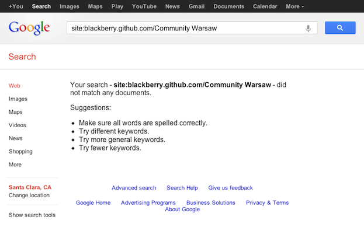
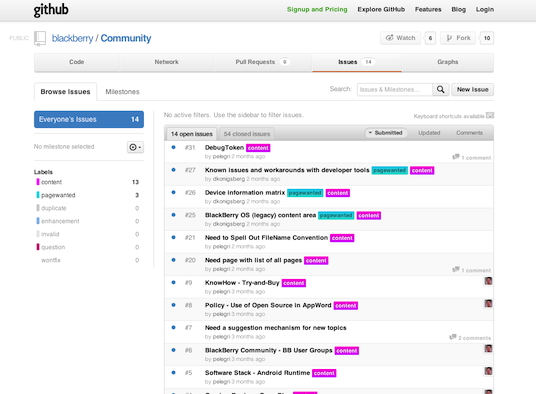
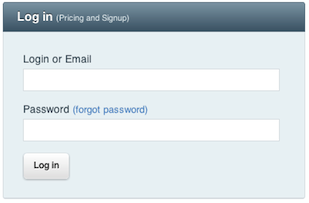
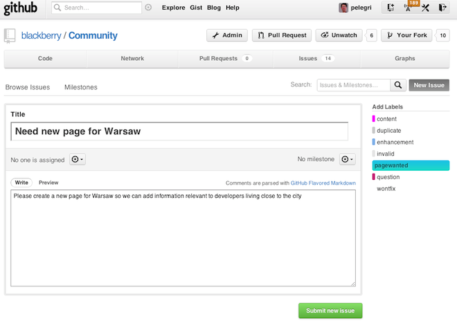



This page describes in detail how to create a new page in the wiki;
for quick changes to an existing page, check [Quick Edit]
An alternative for some situations is to [Propose a New Page][propose new page].

You may want to check the brief [Technology Overview], or just jump right into the instructions.

### Overview

This Wiki is implemented via [GitHub Pages](http://help.github.com/pages/)
using [Markdown](http://daringfireball.net/projects/markdown/)
and [Jekyll](http://github.com/mojombo/jekyll/).
There are two main repositories: [one](http://github.com/blackberry/Community)
for the [released Wiki](http://blackberry.github.com/Community)
and the [other](http://github.com/blackberry-community/Community)
for the [staged Wiki](http://blackberry-community.github.com/Community).

The steps involved are:
* Create a _fork_ of the Staging Wiki repository
* `git clone` from your GitHub fork into a local repos
* Create the new page in your local repository
* Test locally
* `git add` the files
* `git commit` the changes
* `git push` the changes to your fork at GitHub
* Test your changes
* Send a _pull request_ from your fork to the Staging Wiki

-- IMAGE HERE --

### Once Only

You will need:
* A GitHub account
* Git client software installed in your local laptop/desktop
* Access to GitHub (via ssh or https)

See [Technology Overview] for these.

### Fork the (Right) Repo

Start by checking if the page you want to propose already exists.  Look for the search link in the
navigation (left-hand side) menu:

Then follow that link to a Google search page
that is configured for the Community Page as the "site:" attribute.

### Check if a Request Already Exists

If the page does not exist the next step is to check if somebody has already requested the page.
Look at the navigation menu, now follow the link labeled: "Propose Page"

This will open a page on the _pagewanted_ Issues on the [Community Repository](https://github.com/blackberry/Community/issues?labels=pagewanted&milestone=&state=):

### Submit a new Issue

If you don't see what you want there, you can now create a new issue by clicking on the button labeled
<a href="https://github.com/blackberry/Community/issues/new">New Issue</a>.
GitHub.com will next ask you to login if you have not done so...

... and afterwards you can create an issue for your page request using the _pagewanted_ label.

The level of detail will vary depending on the specifics of the pag:
the snapshow below corresponds to a request to create a new page for Warsaw (<a href="https://github.com/blackberry/Community/issues/69">#69</a>)
which can be done by just cloning one of the existing pages for other cities.

### Or Create Directly

Finally, do remember that you can also just create a new page by forking the repository and sending a pull request (see
[details][createnewpage]).
