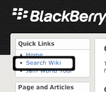
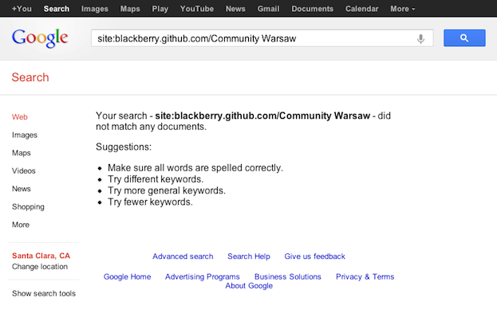
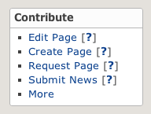
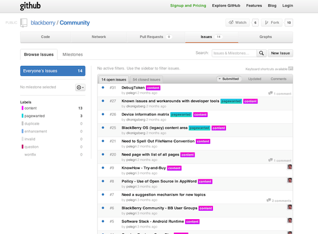
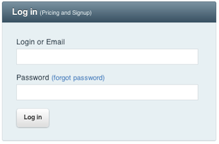
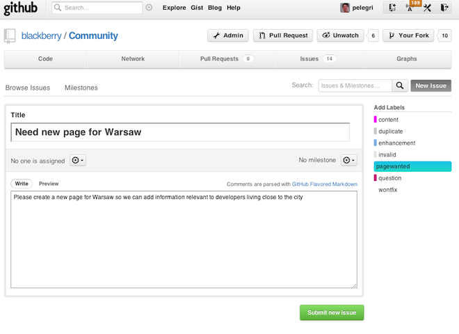



This page describes in detail *How to Propose a New Page* in the Wiki.  

Also see:
* How to do a [Quick Edit][quick edit] to an existing page
* How to [Create a New Page][create new page]
* A brief [Technology Overview]
* An overview of [Contribution Opportunities](Contribute.html).

### Search for Page

Start by checking if the page you want to propose already exists.  Look for the search link in the
navigation (left-hand side) menu:

Then follow that link to a Google search page
that is configured for the Community Page as the "site:" attribute.

### Check if a Request Already Exists

If the page does not exist the next step is to check if somebody has already requested the page.
Look at the navigation menu, now follow the link labeled: "Request Page"

This will open a page on the _pagewanted_ Issues on the [Community Repository](https://github.com/blackberry/Community/issues?labels=pagewanted&milestone=&state=):

### Login...

If you don't see what you want there, you can now create a new issue by clicking on the button labeled
<a href="https://github.com/blackberry/Community/issues/new">New Issue</a>.
GitHub.com will next ask you to login if you have not done so...

### ... and Submit a new Issue

Now just create an issue for your page request using the _pagewanted_ label.

The level of detail will vary depending on the specifics of the pag:
the snapshow below corresponds to a request to create a new page for Warsaw (<a href="https://github.com/blackberry/Community/issues/69">#69</a>)
which can be done by just cloning one of the existing pages for other cities.

