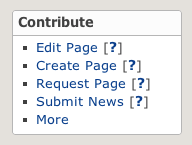



This page describes in detail *How to Edit a Page* in the wiki.  

Also see:
* How to [Propose a New Page][propose new page]
* How to [Create a New Page][create new page]
* A brief [Technology Overview]
* An overview of [Contribution Opportunities](Contribute.html).

### Background

The Wiki is a [Git repo][4] hosted at [GitHub](http://en.wikipedia.org/wiki/GitHub)
using [Pages](http://help.github.com/pages/),
[Markdown](http://daringfireball.net/projects/markdown/ "source files end in .md")
and
[Jekyll](http://github.com/mojombo/jekyll/).

[4]: <http://en.wikipedia.org/wiki/Git_(software)>

There are two main wiki instances: the
[released Wiki][5] and the
[staging Wiki][6].
Individuals may create additional instances, most notably via
[forks](http://help.github.com/fork-a-repo/)
which create a [network of repos](https://github.com/blackberry/Community/network/members),
but the instructions in this page do not require any explicit forking.

[5]: <http://blackberry.github.com/Community/index.html>
[6]: <http://blackberry-community.github.com/Community/index.html>

You will submit contributions to the staging wiki.
If you have enough privileges, your contribution will be accepted automatically, otherwise it
will show as a GitHub [pull request](http://help.github.com/send-pull-requests/)
in the queue of a Wiki editor.
Once your submission has been accepted, a Wiki editor will eventually
promote it to the released wiki.

With this background...

### Locate the Sources for the Wiki Page

First login into GitHub,

Now, go to the page you want to edit. The first item in the *Contribute* page of the left-hand-side panel
is labeled *Edit Page* and links to the sources for the page.

  

Follow the link to browse the source (.md) file for the page.  It will look something like this:

  

### Edit with GitHub Inline

Next is to use GitHub's inline file editing (\[[1]\], \[[2]\], \[[3]\])
to edit and preview your change.

[1]: <https://github.com/blog/143-inline-file-editing> "Inline File Editing"
[2]: <https://github.com/blog/844-forking-with-the-edit-button> "Forking with the Edit Button"
[3]: <https://github.com/blog/905-edit-like-an-ace> "Edit Like an Ace"

Click on *Edit This File* to get to the edit window.

  

Now preview using the built-in machinery. 
The preview is limited to Markdown without layouts, but this is OK for quick edits.

### Submit Your Change

Once you are ready, just submit entering a suitable comment.

  

### Talk with an Editor

The GitHub machinery will accept your change right away, if your account has *push* priviledges on the
staging repo.  If not, a wiki editor will interact with you through comments on your commit contribution and
will help you integrate your change into the Community Wiki.

### Thanks!
